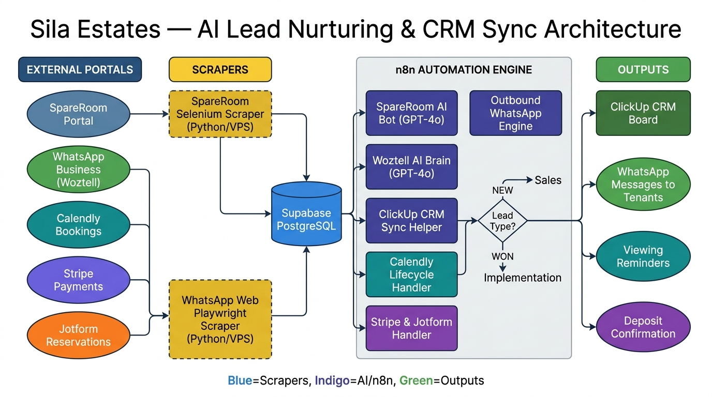
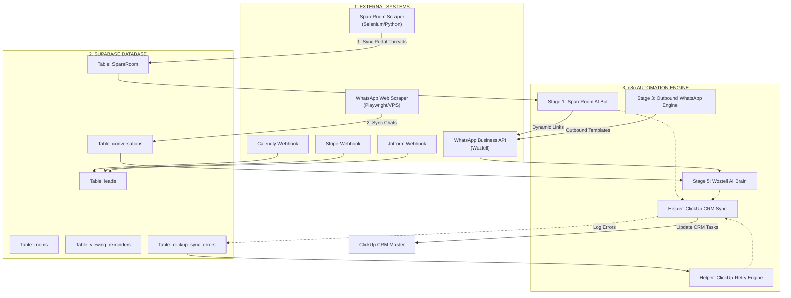

# AI-Powered Lead Nurturing & CRM Sync Platform for Real Estate Portals


> **Industry**: Real Estate & Property Management  |  **Platform**: n8n Cloud + VPS  |  **AI**: GPT-4o

## Executive Summary


The system is designed to automate the tenant acquisition pipeline for property managers by connecting portals, messaging APIs, and CRM dashboards. By integrating custom Python portal scrapers with n8n workflow orchestration, OpenAI's GPT-4o model, Supabase PostgreSQL, the Woztell WhatsApp Business API, Calendly, Jotform, and Stripe, the platform handles the entire lead journey. The system captures inbound SpareRoom portal messages, generates conversational replies, books property viewings, dispatches reservation agreements, handles deposits, and syncs all activity logs to ClickUp in real-time. This automation reduces manual agent overhead and prevents lead leakage by maintaining a 24/7 immediate response loop.

## Project Snapshot

| Category                    | Details |
| --------------------------- | ------- |
| Industry                    | Real Estate & Property Management |
| Business Problem            | High lead latency, heavy manual data entry, lead drop-offs, and disjointed communication channels. |
| Solution                    | End-to-end multi-stage automation connecting portal scrapers, WhatsApp AI Agents, and ClickUp CRM sync. |
| Primary Automation Platform | n8n |
| AI Technology               | OpenAI GPT-4o & GPT-4o-mini |
| Database                    | Supabase (PostgreSQL) |
| Integrations                | WATI/Woztell WhatsApp API, Calendly, Stripe, Jotform, Short.io, ClickUp REST API v2 |
| Deployment                  | Windows Server VPS (Scrapers) & n8n Cloud Workspace |
| Key Outcome                 | Transitioned manual operations into a 24/7 auto-scheduled, self-healing tenant acquisition pipeline. |

---

## The Business Challenge

A high-growth real estate agency managing multiple HMO (House in Multiple Occupation) properties experienced severe operational friction due to manual lead management:

1. **Lead Latency**: Incoming inquiries from property portals (SpareRoom) frequently waited hours for responses during busy days, evenings, or weekends. In the fast-moving rental market, prospects regularly booked viewings with competitors before receiving replies.
2. **Repetitive Administrative Overhead**: Staff spent over 35 hours weekly answering repetitive questions about room features, pricing, ensuites, and transport links, and manually coordinating Calendly booking slots.
3. **Data Silos**: Communication history was fragmented across personal WhatsApp accounts, portal message threads, and email boxes. ClickUp boards were frequently out-of-date due to manual logging lag.
4. **Funnel Drop-offs**: Unresponsive leads who clicked viewing links but did not book appointments were forgotten, resulting in lost pipeline opportunities.
5. **Operational Bottlenecks**: High transaction volume made manually checking reservation forms and reconciling Stripe deposit payments highly prone to human error.

---

## Before Automation

```
[Portal Inquiry] ──(Manual Check)──► [Agent Drafts Reply] ──(Wait for Phone Number)──► [Manual WA Message] ──► [Calendly Scheduling] ──► [Manual CRM Update]
```

Under the legacy manual workflow:
1. Staff periodically logged into SpareRoom to check for unread threads.
2. An agent manually typed a template reply inviting the lead to WhatsApp.
3. If a phone number was obtained, the agent manually saved the contact and initiated a WhatsApp chat.
4. Viewing schedules, reservation forms, and Stripe deposits were tracked on individual spreadsheets.
5. Administrative staff spent hours at the end of each day manually updating ClickUp task statuses.

---

## Goals & Requirements

* **Immediate Portal Auto-Response**: Reply to new SpareRoom inquiries within 60 seconds.
* **Intelligent Conversation Conversion**: Automatically transition portal inquiries to WhatsApp via personalized Short.io links.
* **Bilingual Intent Routing**: Detect user queries and categorize them (Booking, Portfolio List, Specific Agent, Location, or FAQ).
* **Automatic Expiries & Nudge Cadence**: Nudge unbooked leads automatically on WhatsApp at +1h, +2h, +11h, and +23h intervals before closing them.
* **Unified CRM Chat Sync**: Log WATI WhatsApp conversations, closing reasons, and product tags to ClickUp in real-time.
* **Seamless Payment & Onboarding**: Automatically reconcile Stripe deposits, update lead records, and assign onboarding tasks.

---

## Solution Overview

The system acts as a central coordinator between external communication ports, a relational PostgreSQL database, and a CRM platform. 

```
                                      ┌────────────────────────�
                                      │   Supabase Postgres    │
                                      └───────────▲────────────┘
                                                  │
                                                  â–¼
[ SpareRoom / WhatsApp ] ──► [ n8n Orchestrator ] ◄──► [ OpenAI GPT-4o ]
                                  │
                                  â–¼
[ ClickUp CRM ] ◄─────────────────┴──────────────────► [ Calendly / Stripe ]
```

* **Inbound Phase**: Scrapers collect unread portal messages and dump them into Supabase. Webhooks trigger n8n, which parses metadata and runs OpenAI GPT-4o models to generate conversational replies containing dynamic Short.io links.
* **WhatsApp Transition**: Leads matching phone numbers are automatically contacted via Woztell API, sending a templated viewing invitation.
* **Lifecycle & Booking**: If a lead books on Calendly, the system matches their profile (Phone � Name � Email), updates Supabase, and schedules automated SMS reminders 30-min prior and 30-min post viewing.
* **Reconciliation**: Jotform submissions and Stripe webhook payloads update lead statuses to `reserved` and `onboarding_complete` respectively, closing the loop.
* **CRM Sync**: Updates ClickUp custom fields (Pricing, Advert Number, Deposit Status) and writes complete chat transcripts.

---

## System Architecture

### 🗺� Visual Architecture Diagram



*Figure 1: End-to-end system architecture showing portal scrapers, n8n AI engine, Supabase database, and ClickUp CRM sync.*

---

### � Architecture Flowchart (Mermaid)



---

## Workflow Logic

### 1. SpareRoom Bot (Stage 1)
Triggered by scraper webhook � Fetches unread rows from `SpareRoom` � Builds personalized WhatsApp link � Shortens via Short.io � GPT-4o drafts reply or returns `NO_REPLY_NEEDED` � Updates `SpareRoom` table � Scraper posts response to SpareRoom.

### 2. SpareRoom Follow-Up Engine (Stage 2)
Runs on 30-min cron � Scans active unreplied threads � Runs hard stop check (e.g. phone shared or WA active) � Sends up to 4 sequential follow-up templates over 48 hours.

### 3. Outbound WhatsApp Converter (Stage 3)
Runs on 10-min cron � Scans `SpareRoom` table for phone numbers with unsent WhatsApp messages � Matches `advert_number` to `rooms` inventory table � Generates booking link � Creates new lead in `leads` table � Sends WhatsApp template via Woztell API.

### 4. Woztell Main Automation Engine (Stage 5)
Triggered on WhatsApp reply � Groups inbound queue � Identifies lead/portal row � Routing:
* **New Lead**: Detects intent � Scenario A (send Calendly link), Scenario B (ask source), or Scenario D (send portfolio list).
* **Existing Lead**: Loads chat history � Routes phase � AI Agent selects Action (`BOOK_ROOM`, `SEND_ALL_ADVERTS`, `TRIPLE_RESPONSE`) � Sends message via Woztell � Log saved to `messages` � Marks queue processed.

### 5. Viewing & Reservation reminders (Stage 7 & 8)
Calendly event updates status to `viewing_booked` � n8n schedules reminders in `viewing_reminders` � 10-min cron dispatches 30-min prior warning, 30-min post viewing Jotform link, and +1h follow-up nudge.

### 6. Stripe Deposit & Onboarding (Stage 10)
Stripe payment webhook matched to lead � Updates `reservation_response = COMPLETED` � Triggers tenant onboarding tasks and moves CRM status.

---

## AI / Agent Architecture

The conversational AI system uses OpenAI's GPT-4o model, guided by structured prompt guidelines:
* **UK English Formatting**: Spells all vocabulary phonetically according to British English standards.
* **Greeting Rules**: Ensures greetings ("hi", "hello") always trigger replies, bypassing standard "no reply needed" conditions.
* **First Name Extraction**: Strips full contact strings to keep tone natural.
* **Information Cleaning**: Pre-processing JavaScript node automatically strips SpareRoom UI metadata and footer buttons before the prompt is processed.
* **Action Routing**: Dynamic JSON outputs specify the next step, phase, and internal action:
  ```json
  {
    "reply": "message text or empty",
    "action": "BOOK_ROOM / SEND_ALL_ADVERTS / TRIPLE_RESPONSE / null",
    "isClosed": false
  }
  ```

---

## Data Flow

```text
Portal message received
    ↓
Scraper intercepts thread
    ↓
Supabase Database Insert (answer_generated = false)
    ↓
n8n Webhook / Pre-processing (clean SpareRoom UI artifacts)
    ↓
OpenAI GPT-4o Logic (extract name, determine intent & action)
    ↓
Short.io Link Generation (personal booking link)
    ↓
WATI WhatsApp Business API dispatch
    ↓
ClickUp CRM Sync (update custom fields & chatter transcript)
```

---

## Integrations

| System   | Purpose |
| -------- | ------- |
| n8n      | Central workflow coordination and event routing |
| WATI     | WhatsApp Business API interface for tenant messaging |
| OpenAI   | Intent classification, conversation cleaning, and draft generation |
| Supabase | Persistent relational database engine storing lead states and metadata |
| ClickUp  | Main operations dashboard and client CRM board |
| Calendly | Dynamic viewing appointment booking and cancellation gateway |
| Stripe   | Secure holding deposit payment processor |

---

## Reliability & Error Handling

* **Central Sync Error Retry Queue**: Failed ClickUp API updates are written to `clickup_sync_errors` and retried automatically every 30 minutes (up to 5 attempts).
* **Double Webhook Verification**: Prevents webhook spoofing by querying Calendly and Stripe APIs directly using unique event IDs before executing state changes.
* **Two-Layer Deduplication**: Combines n8n in-memory SHA-256 hash sets with a PostgreSQL `UNIQUE INDEX` to prevent race conditions from rapid tenant messages.
* **Session Expiry Alarm System**: Scraper monitors SpareRoom cookies, logging warnings 5 days before expiration and notifying operators via n8n email alerts.

---

## Edge Cases

* **Accidental Greetings/Loops**: If a user sends automated greeting loops, the bot detects consecutive agent sends and stops replies, handing over to humans.
* **Name & Number Extraction Failures**: If the scraper profile extraction fails, the system falls back to regex sweeps on message headers and direct WhatsApp data attributes.
* **Stripe Payment Failure**: Posts an alert comment on ClickUp, assigns task to property manager, and emails the tenant a payment retry link.

---

## Security & Data Privacy

* **Data Isolation**: Database tables are separated by access layer; WATI credentials and Odoo database tokens are secured via environment variables.
* **Masked Phone Fields**: Prevents raw phone number exposure in public logs.
* **Minimal Scope Access**: n8n connections use minimal API keys restricted to necessary spaces and folders in ClickUp.

---

## Results & Business Impact

### Operational Improvements

* **24/7 Portal Response Coverage**: The system replies to SpareRoom inquiries instantly, even during nights and weekends.
* **Automated Lead Progression**: Leads are qualified, booking links are sent, and reminders are dispatched without manual intervention.
* **Centralized Data Sync**: Full WhatsApp conversation histories are archived in ClickUp chatter logs, eliminating data silos.
* **Self-Healing Error Correction**: The central sync retry queue resolves transient network failures automatically, ensuring zero data loss.

---

## Before vs After

| Area | Before | After |
| --- | --- | --- |
| Response Speed | Manual (4-12 hours lag) | Automated (<60 seconds) |
| Availability | Business Hours only | 24/7 / 365 Days |
| Data Entry | Manual copy-pasting | Automated CRM sync |
| Lead Qualification | Manual conversation | Automated intent parsing |
| Expiries / Expirations | Manual tracking | Automated nudge & close crons |

---

## Technical Challenges

### Problem
Mermaid subgraphs overlapped with top nodes when HTML formatting tags (`<font size="5">`) were used in subgraph titles.

### Root Cause
Mermaid's Dagre layout engine miscalculated the height of the subgraph title box when HTML font size tags were present, positioning nodes directly over the title.

### Solution
Removed inline HTML sizing from subgraph titles and adjusted global Mermaid configurations:
```mermaid
%%{init: { 'flowchart': { 'nodeSpacing': 25, 'rankSpacing': 35 } }}%%
```

### Result
 Mermaid rendered clean, legible subgraphs with proper spacing and zero title overlap.

---

## Key Engineering Decisions

* **Why Supabase over spreadsheets?** Supabase provides real-time PostgreSQL listeners, relational database integrity (joining leads to rooms by advert number), and fast transaction execution.
* **Why n8n orchestrator?** n8n enables asynchronous event routing, visual debugging of complex decision nodes, and robust webhook retry structures.
* **Why decouple scrapers from AI processing?** Separating browser automation (Selenium/Playwright) from the AI replying logic prevents workflow timeouts and allows scrapers to run independently on local VMs.

---

## Scalability

* **Multi-Account Support**: The scraper structure supports scaling to multiple SpareRoom accounts by caching individual `.session` cookies.
* **Modular Webhook Routers**: All major actions (ClickUp Sync, Short.io generation, Calendly matching) are isolated into reusable sub-workflows, enabling quick expansion to new listing portals.

---

## Future Improvements

* **AI Voice Call Handoff**: Integrate Vapi/Synthflow voice agents to handle inbound viewing booking phone calls.
* **Direct Webhook closure**: Transition to live webhook listeners if portal APIs release real-time chat close endpoints.
* **Tenant Analytics Dashboard**: Build a Next.js web application linked to Supabase to visualize lead funnel statistics.

---

## Tech Stack

### Automation
* n8n

### AI
* OpenAI GPT-4o & GPT-4o-mini

### Database
* Supabase (PostgreSQL)

### Messaging
* Woztell WhatsApp Business API

### Scrapers
* Python (Selenium & Playwright)

### APIs
* Calendly, Stripe, Jotform, ClickUp REST API, Short.io

---

## Project Architecture Summary

The platform uses n8n to connect portal scrapers, WhatsApp gateways, scheduling systems, and payment portals. Inbound messages are captured, stored in Supabase, evaluated by GPT-4o for intent and context, and answered with dynamic links. Event updates (bookings, payments) automatically sync to ClickUp CRM via a centralized sync helper with built-in retry logic.

---

## What This Project Demonstrates

* **End-to-End Workflow Integration**: Connects diverse platforms into a single, cohesive automation system.
* **AI Decision Routing**: Uses OpenAI prompts to make complex logic routing decisions.
* **Database & CRM Design**: Relational data structures with automated bi-directional CRM syncing.
* **Production-Grade Reliability**: Implements deduplication, double webhook verification, and automatic retry queues.

---

## Why This Matters to a Business

Automating lead capturing and nurturing processes ensures that inquiries are addressed instantly, maximizing conversion rates. It eliminates repetitive administrative tasks, letting teams focus on operations while keeping CRM records updated in real-time.

---

## Case Study Takeaways

* Replaced manual portal messaging with a 24/7 automated agent.
* Connected messaging, calendar, payment, and CRM platforms.
* Built-in error handling and retry queues to prevent data loss.
* Designed modular workflows that scale easily as the portfolio grows.

---

## Client Testimonial

> "Integrating this automation system transformed our lead management pipeline. We no longer worry about missing after-hours inquiries on SpareRoom, and our CRM is updated automatically. It has greatly reduced our admin workload and allowed our team to focus on serving our tenants."  
> — **Operations Lead, Co-Living Management Agency**


---

## ?? Interested in a Similar System?

> Want to build something like this? Let's talk.

Whether you want to:
- ?? **Replicate this exact system** for your own business
- ??? **Build a custom automation** tailored to your workflow
- ?? **Discuss how AI automation** can solve your specific problem

**Feel free to reach out — I'd love to help.**

[](http://linkedin.com/in/aina-asim-659b67369)
[](https://wa.me/923206455471)

?? **WhatsApp:** +92 320 6455471  
?? **LinkedIn:** [Aina Asim](http://linkedin.com/in/aina-asim-659b67369)
